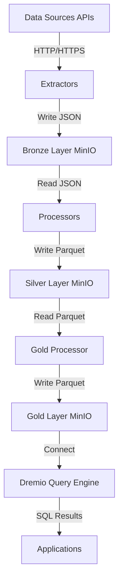

# System Architecture

This document describes the technical architecture of the E-Procurement Data Pipeline system.

---

## Table of Contents

1. [System Overview](#system-overview)
2. [Component Architecture](#component-architecture)
3. [Data Flow](#data-flow)
4. [Infrastructure](#infrastructure)
5. [Technology Stack](#technology-stack)
6. [Deployment](#deployment)
7. [Query Architecture](#query-architecture)

---

## System Overview

The E-Procurement Data Pipeline is built using a **medallion architecture** (Bronze → Silver → Gold) pattern for data lake processing. It integrates multiple European procurement data sources into a unified analytics platform.

### High-Level Architecture

```
┌──────────────────────────────────────────────────────────────┐
│                    DATA SOURCES                              │
│  • Open Contracting Partnership (11 publications)            │
│  • BASE Portugal (dados.gov.pt OCDS API)                     │
│  • TED Europe (Partner team data)                            │
└────────────────────────┬─────────────────────────────────────┘
                         ↓
         ┌───────────────────────────────┐
         │      EXTRACTION LAYER         │
         │  • Python Extractors          │
         │  • REST API Clients           │
         │  • Rate Limiting              │
         │  • Error Handling             │
         └───────────────┬───────────────┘
                         ↓
┌──────────────────────────────────────────────────────────────┐
│               BRONZE LAYER (Raw Storage)                     │
│  Storage: MinIO (S3-compatible object storage)               │
│  Format:  JSON (OCDS format)                                 │
│  Partition: source/country/year/month/day                    │
│  Files: ~2,447 JSON files                                    │
└────────────────────────┬─────────────────────────────────────┘
                         ↓
         ┌───────────────────────────────┐
         │    PROCESSING LAYER           │
         │  • Pandas DataFrames          │
         │  • Schema Normalization       │
         │  • Data Validation            │
         │  • Field Mapping              │
         └───────────────┬───────────────┘
                         ↓
┌──────────────────────────────────────────────────────────────┐
│              SILVER LAYER (Cleaned Data)                     │
│  Storage: MinIO                                              │
│  Format:  Apache Parquet (Snappy compression)                │
│  Schema:  Unified 27-field OCDS schema                       │
│  Partition: source/country/year/month                        │
│  Files: ~1,097 Parquet files                                 │
└────────────────────────┬─────────────────────────────────────┘
                         ↓
         ┌───────────────────────────────┐
         │     GOLD PROCESSOR            │
         │  • Multi-source Unification   │
         │  • Category Standardization   │
         │  • Deduplication              │
         │  • Aggregation                │
         └───────────────┬───────────────┘
                         ↓
┌──────────────────────────────────────────────────────────────┐
│            GOLD LAYER (Analytics-Ready)                      │
│  Storage: MinIO                                              │
│  Format:  Apache Parquet                                     │
│  Datasets:                                                   │
│    • unified/all_tenders.parquet (536K records)              │
│    • aggregates/country_summary.parquet                      │
│    • aggregates/monthly_trends.parquet                       │
│    • aggregates/category_analysis.parquet                    │
│    • aggregates/top_buyers.parquet                           │
│    • aggregates/top_suppliers.parquet                        │
│    • quality/quality_report.json                             │
└────────────────────────┬─────────────────────────────────────┘
                         ↓
         ┌───────────────────────────────┐
         │      QUERY LAYER              │
         │    Dremio Query Engine        │
         │  • SQL Interface              │
         │  • Query Optimization         │
         │  • Result Caching             │
         └───────────────┬───────────────┘
                         ↓
         ┌───────────────────────────────┐
         │   APPLICATION LAYER           │
         │  • NLP Chatbot API            │
         │  • Frontend (Planned)         │
         └───────────────────────────────┘
```

---

## Component Architecture

### 1. Data Extractors

**Location**: `src/extractors/{source}/`

Each data source has a dedicated extractor module:

```
src/extractors/
├── open_contracting_partnership/
│   ├── extractor.py          # Main extraction logic
│   ├── config.py             # Publication URLs, endpoints
│   └── main.py               # CLI entry point
├── base_portugal/
│   ├── extractor.py          # dados.gov.pt API client
│   ├── config.py             # API endpoints, dataset IDs
│   └── main.py               # CLI entry point
└── ted/
    └── (partner team data processing)
```

**Key Responsibilities**:
- Fetch data from source APIs/files
- Handle pagination and rate limiting
- Convert to OCDS JSON format
- Write to Bronze layer (MinIO or local filesystem)
- Track extraction state (incremental updates)

**Technologies**:
- `requests`: HTTP client
- `pandas`: Data manipulation
- `json`: JSON serialization
- Custom MinIO client

### 2. Data Processors

**Location**: `src/processing/{source}/`

Each source has a corresponding processor for Bronze → Silver transformation:

```
src/processing/
├── open_contracting_partnership/
│   ├── transformer.py        # Bronze → Silver logic
│   ├── validators.py         # Data validation rules
│   ├── config.py             # Field mappings
│   ├── parquet_writer.py     # Parquet output
│   └── main.py               # CLI entry point
├── base_portugal/
│   ├── transformer.py        # Bronze → Silver logic
│   ├── validators.py         # Portugal-specific validation
│   ├── config.py             # Field mappings
│   ├── parquet_writer.py     # Parquet output
│   └── main.py               # CLI entry point
└── ted/
    ├── transformer.py        # TED data normalization
    ├── validators.py         # TED-specific validation
    ├── config.py             # Field mappings
    └── main.py               # CLI entry point
```

**Key Responsibilities**:
- Read Bronze layer JSON files
- Extract and map fields to unified schema
- Validate data quality (required fields, formats)
- Clean and normalize values
- Compute record hashes (for deduplication)
- Write Parquet files to Silver layer
- Partition by country/year/month

**Technologies**:
- `pandas`: Data transformation
- `pyarrow`: Parquet I/O and schema enforcement
- Custom validation logic

### 3. Gold Layer Processor

**Location**: `src/gold_layer/`

Unified processing for Silver → Gold transformation:

```
src/gold_layer/
├── config.py                 # Constants, mappings, schema
├── unifier.py                # Merge all Silver sources
├── aggregator.py             # Pre-computed aggregates
├── quality.py                # Quality reports
├── upload_to_minio.py        # Upload to MinIO
└── main.py                   # Orchestration
```

**Key Responsibilities**:
- Load all Silver layer Parquet files
- Merge sources with source tagging
- Standardize categories (multi-language → English)
- Add derived fields (year, month, quarter, quality flags)
- Deduplicate records (by OCID + source)
- Generate aggregates (country, monthly, categories, etc.)
- Write unified dataset and aggregates to Gold layer
- Generate quality reports

**Technologies**:
- `pandas`: Multi-source merge and aggregation
- `pyarrow`: Partitioned Parquet writing
- JSON for quality reports

### 4. Storage Layer

**Location**: `src/storage/`

MinIO client wrapper for object storage operations:

```
src/storage/
└── minio_client.py           # S3-compatible client
```

**Key Responsibilities**:
- Connect to MinIO server
- Create buckets (bronze, silver, gold)
- Upload/download objects
- List objects with filtering
- Read/write JSON and Parquet files
- Handle errors and retries

**Technologies**:
- `minio` library
- `boto3` (alternative S3 client)

### 5. Common Utilities

**Location**: `src/common/`

Shared utilities across components:

```
src/common/
├── state_manager.py          # Track processing state
└── utils.py                  # Helper functions
```

**Key Responsibilities**:
- Incremental processing state management
- File tracking (processed vs. pending)
- Logging configuration
- Shared utility functions

---

## Data Flow

### End-to-End Pipeline



### Detailed Flow by Layer

#### 1. Bronze Layer Flow

```
Source API → Extractor → JSON Files → MinIO (bronze bucket)
                ↓
         Rate Limiting
         Error Handling
         State Tracking
```

**Path Pattern**: `bronze/{source}/{country}/{year}/{month}/{day}/records_{timestamp}.json`

**Example**: `bronze/base_portugal/portugal/2024/12/20/records_20251220_214501.json`

#### 2. Silver Layer Flow

```
MinIO (bronze) → Processor → Validation → Transformation → Parquet → MinIO (silver)
                      ↓            ↓             ↓
                Schema Mapping   Cleaning    Hashing
```

**Path Pattern**: `silver/{source}/{country}/{year}/{month}/tenders_{timestamp}.parquet`

**Example**: `silver/base_portugal/portugal/2024/12/tenders_20251220_215122.parquet`

#### 3. Gold Layer Flow

```
MinIO (silver) → Unifier → Merge Sources → Standardize → Deduplicate
                                                ↓
                                        Unified Dataset
                                                ↓
                                         Aggregator
                                                ↓
                              ┌─────────────────┼─────────────────┐
                              ↓                 ↓                 ↓
                    Country Aggregates   Monthly Trends   Top Buyers/Suppliers
                              ↓                 ↓                 ↓
                         MinIO (gold bucket)
```

**Datasets**:
- `gold/unified/all_tenders.parquet` - Master dataset (536K records)
- `gold/aggregates/country_summary.parquet`
- `gold/aggregates/monthly_trends.parquet`
- `gold/aggregates/category_analysis.parquet`
- `gold/aggregates/top_buyers.parquet`
- `gold/aggregates/top_suppliers.parquet`
- `gold/quality/quality_report_{timestamp}.json`

---

## Infrastructure

### Docker Compose Setup

**Location**: `infra/docker-compose.yml`

```yaml
services:
  minio:
    image: minio/minio:latest
    ports:
      - "9000:9000"  # S3 API
      - "9001:9001"  # Console UI
    volumes:
      - minio_data:/data
    environment:
      MINIO_ROOT_USER: minioadmin
      MINIO_ROOT_PASSWORD: minioadmin

  dremio:
    image: dremio/dremio-oss:latest
    ports:
      - "9047:9047"  # Web UI
      - "31010:31010" # ODBC/JDBC
      - "32010:32010" # Arrow Flight
    volumes:
      - dremio_data:/opt/dremio/data

  chatbot-api:
    build:
      context: ..
      dockerfile: infra/dockerfile/chatbot-api/Dockerfile
    ports:
      - "8000:8000"  # FastAPI server
    env_file:
      - .env
    depends_on:
      - dremio
```

### MinIO Configuration

**Access**:
- **Console UI**: http://localhost:9001
- **S3 API**: http://localhost:9000
- **Credentials**: minioadmin / minioadmin

**Buckets**:
- `bronze`: Raw JSON files (~2,447 objects)
- `silver`: Cleaned Parquet files (~1,097 objects)
- `gold`: Unified dataset + aggregates (~7 objects)

**Storage Structure**:
```
minio/
├── bronze/
│   ├── open_contracting_partnership/
│   │   ├── germany/
│   │   ├── uk/
│   │   └── ... (7 countries)
│   ├── base_portugal/
│   │   └── portugal/
│   └── partner_data/
│       └── andré&abel/
├── silver/
│   ├── open_contracting_partnership/
│   ├── base_portugal/
│   └── ted/
└── gold/
    ├── unified/
    ├── aggregates/
    └── quality/
```

### Dremio Configuration

**Access**:
- **Web UI**: http://localhost:9047
- **Arrow Flight**: http://localhost:32010
- **ODBC/JDBC**: localhost:31010
- **Credentials**: admin / password123 (initial setup)

**Data Sources**:
1. **MinIO Source** (`minio`):
   - Type: S3-compatible
   - Endpoint: http://minio:9000
   - Access Key: minioadmin
   - Secret Key: minioadmin
   - Encryption: None
   - Path Style Access: Enabled

**Datasets** (after formatting):
- `minio.bronze` - Raw data (not queried directly)
- `minio.silver.{source}` - Cleaned data
- `minio.gold.unified` - Master dataset ✅ Primary query target
- `minio.gold.aggregates` - Pre-computed aggregates

---

## Technology Stack

### Programming Languages
- **Python 3.10+**: Primary language for all data processing

### Data Processing
- **Pandas 2.x**: DataFrames, transformations, aggregations
- **PyArrow 14.x**: Parquet I/O, schema enforcement, Arrow format
- **NumPy**: Numerical operations

### Storage & Query
- **MinIO**: S3-compatible object storage (data lake)
- **Dremio**: Distributed SQL query engine (lakehouse)
- **Apache Parquet**: Columnar storage format

### Data Extraction
- **Requests**: HTTP client for API calls
- **openpyxl**: Excel file reading (BASE Portugal)
- **json**: JSON parsing and serialization

### Infrastructure
- **Docker**: Containerization
- **Docker Compose**: Multi-container orchestration

### Development Tools
- **Make**: Task automation (Makefile)
- **Git**: Version control
- **Python venv**: Virtual environment management

---

## Deployment

### Local Development Setup

1. **Clone Repository**:
   ```bash
   git clone <repository-url>
   cd hw2
   ```

2. **Start Infrastructure**:
   ```bash
   cd infra
   docker-compose up -d
   ```

3. **Create Python Environment**:
   ```bash
   python -m venv venv
   source venv/bin/activate
   pip install -r requirements.txt
   ```

4. **Configure Environment**:
   ```bash
   cp .env.example .env
   # Edit .env with MinIO and Dremio credentials
   ```

5. **Initialize MinIO Buckets**:
   ```bash
   make minio-init
   ```

6. **Run Pipeline**:
   ```bash
   make extract          # Bronze layer
   make process          # Silver layer
   make gold-layer       # Gold layer
   ```

### Production Considerations

**Not implemented yet**, but recommended for production:

1. **Orchestration**: Apache Airflow or Prefect for workflow scheduling
2. **Monitoring**: Prometheus + Grafana for metrics
3. **Logging**: Centralized logging (ELK stack)
4. **Secrets Management**: HashiCorp Vault or AWS Secrets Manager
5. **Scaling**: Kubernetes for container orchestration
6. **Distributed Processing**: Apache Spark for large-scale transformations

---

## Query Architecture

### Dremio Setup Process

1. **Add MinIO as Source**:
   - Navigate to Dremio UI (http://localhost:9047)
   - Add "External Source" → "Amazon S3"
   - Configure:
     - Name: `minio`
     - Endpoint: `http://minio:9000`
     - Access/Secret Key: `minioadmin`
     - Enable "Path Style Access"

2. **Refresh Metadata**:
   - Right-click `minio` source
   - Select "Refresh Metadata"
   - Wait for discovery (~10 seconds)

3. **Format Folders as Datasets**:
   - Navigate to `minio.gold.unified`
   - Right-click folder → "Format Folder"
   - Select "Parquet" → Save
   - Repeat for `minio.gold.aggregates`

### Example Queries

#### Basic Queries

```sql
-- Total records
SELECT COUNT(*) as total_tenders
FROM minio.gold.unified;
```

#### Country Analysis

```sql
-- Top 10 countries by tender count
SELECT
    source_country,
    COUNT(*) as tender_count,
    SUM(tender_value_amount) as total_value,
    AVG(tender_value_amount) as avg_value
FROM minio.gold.unified
WHERE tender_value_amount > 0
GROUP BY source_country
ORDER BY tender_count DESC
LIMIT 10;
```

#### Time-Series Analysis

```sql
-- Monthly tender trends (2024-2025)
SELECT
    year,
    month,
    COUNT(*) as tender_count,
    SUM(tender_value_amount) as total_value
FROM minio.gold.unified
WHERE year IN (2024, 2025)
    AND date_quality_flag = 'valid'
GROUP BY year, month
ORDER BY year, month;
```

#### Procurement Categories

```sql
-- Breakdown by standardized category
SELECT
    procurement_category_standardized,
    COUNT(*) as count,
    ROUND(COUNT(*) * 100.0 / SUM(COUNT(*)) OVER(), 2) as percentage
FROM minio.gold.unified
WHERE procurement_category_standardized != ''
GROUP BY procurement_category_standardized
ORDER BY count DESC;
```

#### High-Value Tenders

```sql
-- Tenders over 1M EUR
SELECT
    tender_title,
    buyer_name,
    tender_value_amount,
    tender_value_currency,
    source_country,
    publication_date
FROM minio.gold.unified
WHERE tender_value_amount > 1000000
    AND tender_value_currency = 'EUR'
ORDER BY tender_value_amount DESC
LIMIT 100;
```

### Query Performance

**Optimization strategies used**:
- **Partitioning**: Data partitioned by country/year/month for predicate pushdown
- **Columnar Format**: Parquet allows reading only required columns
- **Compression**: Snappy compression reduces I/O
- **Caching**: Dremio caches query results and metadata

**Typical Performance**:
- Simple count query: ~1-2 seconds (first run), <500ms (cached)
- Aggregation (10 countries): ~2-3 seconds
- Complex join/filter: ~5-10 seconds (536K records)

---

## Security Considerations

### Current Setup (Development)

⚠️ **Not production-ready** - Uses default credentials:
- MinIO: `minioadmin` / `minioadmin`
- Dremio: `admin` / `password123`
- No TLS/SSL encryption
- No authentication on APIs
- No network isolation

### Recommendations for Production

1. **Authentication**:
   - Use strong passwords
   - Enable SSO (OAuth/SAML) for Dremio
   - Use IAM roles for MinIO (if cloud deployment)

2. **Encryption**:
   - Enable TLS for MinIO and Dremio
   - Encrypt data at rest
   - Encrypt secrets (use secret management tools)

3. **Network**:
   - Use private networks
   - Firewall rules to restrict access
   - VPN for remote access

4. **Audit**:
   - Enable access logs in MinIO
   - Query logs in Dremio
   - Track data lineage

---

## Extensibility

### Adding New Data Sources

1. **Create Extractor**:
   - `src/extractors/new_source/extractor.py`
   - Implement API/file reading logic
   - Output OCDS-compatible JSON to Bronze layer

2. **Create Processor**:
   - `src/processing/new_source/transformer.py`
   - Map source fields to unified schema
   - Add validation rules
   - Output Parquet to Silver layer

3. **Update Gold Layer**:
   - Add source to `gold_layer/unifier.py`
   - Extend category mappings if needed
   - Re-run Gold generation

4. **Update Makefile**:
   - Add `extract-newsource` target
   - Add to `extract-all` dependency

### Adding New Aggregates

1. **Edit `gold_layer/aggregator.py`**:
   - Add new aggregation function
   - Write new Parquet file to `gold/aggregates/`

2. **Format in Dremio**:
   - Refresh metadata
   - Format new dataset folder

---

## References

### Documentation
- [MinIO Documentation](https://min.io/docs/)
- [Dremio Documentation](https://docs.dremio.com/)
- [Apache Parquet Format](https://parquet.apache.org/docs/)
- [OCDS Standard](https://standard.open-contracting.org/)

### Internal Docs
- [Data Layers](data_layers.md) - Bronze/Silver/Gold specifications
- [Data Sources - European](data_sources_european.md)
- [Data Sources - Portugal](data_sources_portugal.md)
- [Development Guide](development_guide.md)
- [NLP Chatbot Implementation](chatbot.md) - Natural language query interface

---

**Last Updated**: 2024-12-21
**Version**: 1.0
